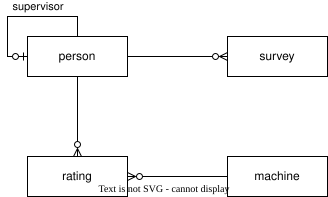

# More Practice Questions

<figure id="f:more_er">
  
  <figcaption>Surveys ER Diagram</figcaption>
</figure>

<a href="https://github.com/gvwilson/sql/raw/refs/heads/main/db/surveys.db">download surveys SQLite database file</a>

## 1. Show each person's first and last name.

## 2. Count the number of people.

## 3. Show all people who supervise someone else.

## 4. Show people with no supervisor.

## 5. Show each person's full name and their supervisor's full name.

## 6. Find surveys with no end date.

## 7. Show surveys with their owner's name.

## 8. Show distinct machine types.

## 9. Count machines by type.

## 10. Find ratings above level 1.

## 11. Show who has a rating for which machine.

## 12. Calculate each person's average rating on all machines.

## 13. Show people who have at least one machine rating.

## 14. Show machines that no one has a rating for.

## 15. Show how many surveys each person is associated with.

## 16. Show people who do not have ratings for any machines.

## 17. Find machines that have not been rated by person P001.

## 18. Find supervisors who are not associated with any surveys.

## 19. Show people who have ratings for more than one type of machine.

## 20. Find the highest rating that anyone has on any kind of machine.

## 21. Show all of the people who have that highest rating for any kind of machine.

## 22. Show the length in days of each survey.

## 23. Show the total length of time that each person has spent doing surveys.

## 24. Find the longest time *between* surveys for each person.
